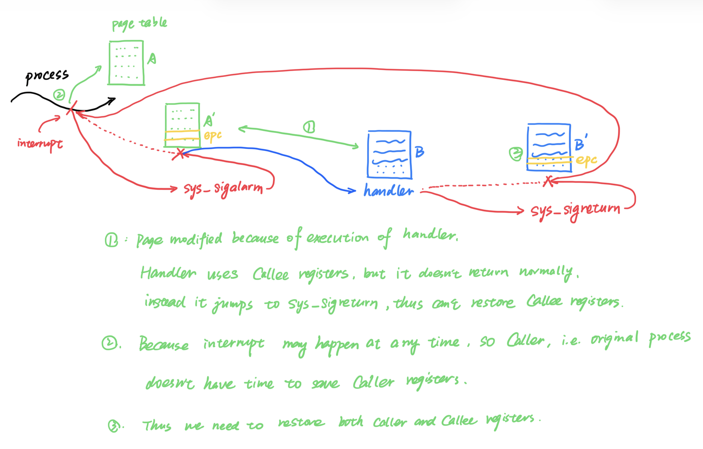

## Error during Compilation

When compiling the xv6, encountered two compilation errors, I compile on
platform macOS with HomeBrew, install QEMU stable version 10.1.2,
riscv/riscv/riscv-tools stable version 0.2.
So I changed two places in the source code pulled from
git://g.csail.mit.edu/xv6-labs-2021, one is infinite recursion error in
`/user/sh.c`, the `runcmd` function, another one is incompatible pointer in
`user/usertests.c`.

I fixed the first error by change signature of `runcmd` to be
`__attribute__((noreturn)) void runcmd`, according to
[this link](https://github.com/mit-pdos/xv6-riscv/pull/126).

I fixed the second error by change the signature of `rwsbrk` to be `void
rwsbrk(char *s)`, according to [this link](https://github.com/mit-pdos/xv6-riscv/commit/a3f3a04f913535868f5030d9845f7e4b90edb379).

Now I can compile successfully.

## Lab util

### Sleep

`kernel/sysproc.c` implements the `sleep` system call, which is the code run
when entering kernel space. The `sleep` callable from a user program in
`user/user.h` is actually implemented in `user/usys.S`, which loads the address
for the `sleep` system call in `kernel/sysproc.c` and then run `ecall`.

### Pingpong

Some notes for this part

- For a pipe `p`, the read end is `p[0]`, the write end is `p[1]`, can't be
  exchanged.
- No need to wait for child to return, because `read` will pause until all file
  descriptors referring to the write end to be closed
- Should handle all the errors for library functions
- Also checked that whether the read contents match the written contents

### Find

Some notes for this part

- When trying to get the type of the items in the directory, we can use `stat`,
  with which we don't need to open the file to get a file descriptor, and
  don't need to close it after retrieving status. Otherwise, if we forget to
  close the file descriptor, it's very likely to run out of file descriptors
- Can print the error message to `stderr` using `fprintf` with `2` as the file
  descriptor, but if the error happens when trying to get the status of the
  items in the directory, can just use `printf`
- Follows the convention in `ls.c`, the maximum length of the file name is
  defined as `DIRSIZ`, and no matter no many characters the actual file name
  has, we always use a fixed length buffer (which is `DIRSIZ`) to store it
- `dirent` stands for directory entry. xv6 book mentioned that, each `inode`
  can have multiple names, called *links*, and each link consists of an **entry
  in a directory**, and that's actually `dirent`. It also mentioned that, the
  entry contains a file name and a reference to an inode, which is `inum` and
  `name` in `struct dirent`.

### Xargs

Use `malloc` to allocate memory when storing the command args into a new `argv`
array, which later will be fed into `exec` in the child process.
Remember to free up this part of memory to avoid memroy leak.

## System Calls

### System Call Tracing

In `sysproc.c`, `sys_trace` reads calling arguments to variable `mask`, and
store this `mask` to field `traced_syscall` of `proc`.  
Then in `syscall.c`, when we call system calls, we check whether there's a mask
bit in `proc.traced_syscall`, if it is, then we print out tracing information

### Sysinfo

In `sysproc.c`, `sys_sysinfo` reads the calling arguments to variable `info_t`,
which is the address that the user wants to store `sysinfo`.

To get the free memory size, according to the contents in `book-riscv-rev4`
Chapter 3.5, in `kalloc.c` we use a struct `kmem` to store all free pages in a list
`keme.freelist`. So we just need to iterate through this list, find how many
pages are free, and then multiply with the page size.

To get the number of processes, see `allocproc` function in `proc.c` for hint.
We have to iterate through all processes stored in `proc[]`, check the status
of each process, and count the number of processes whose state is not `UNUSED`.

Finally we use `copyout` to copy the struct `sinfo` back to user page table. As
is mentioned in `book-riscv-rev4` Chapter 4.4, `copyout` will use `walk` to
find the PA of VA `info_t`, and then store `sinfo` into that address

## Page Tables

### Speed Up System Calls

The steps for this part are

- Modify `proc` struct to store PA of usyscall page
- Allocate and initialize page for usyscall page in `allocproc`
- Performing page mapping in `proc_pagetable`
- Free the page in freeproc
- Unmap the page in `proc_freepagetable`
    - Otherwise will get `freewalk` error because PTE_V hasn't been removed
      before freeing the page table

This shared page can only be used to trasfer data from kernel to user, because
this page is read-only from user's point of view.
Thus only system calls that transfer data from kernel to user can be speed up
with this method.

Thus except `getpid`, only `fstat` can be speed up with shared pages

To test this part, run `make GRADEFLAGS=ugetpid grade`.

### Print a page table

Because the leading dots are different for three level of page tables, so maybe
it's better to pass in an integer to represent different layers

- The permission for Page 0 is `UXWRV`, thus it contains `text`, although it's strange to have `W` permission
- The permission for Page 2 is `UXWRV`, the permission for Page 1 is `XWRV`, thus Page 1 is a guard page, which user can't access.
	- Then Page 2 is a stack page
- According to the permission of Page 1, which is `XWRV`. It doesn't contain `U`, thus user can't R/W the memory mapped 
- The permission of the third to last page is `URV`, which is just the page we added in the first part

To test this part, run `make GRADEFLAGS=printout grade`.

### Detecting which pages have been accessed

- To use `walk`, need to add this to `defs.h`
- User pagetable is stored in `proc` struct, one process can switch in kernel
  mode and user mode

To test this part, run `make GRADEFLAGS=pgaccess grade`.

## Traps

### RISC-V Assembly

```asm
24:	1141                	addi	sp,sp,-16
26:	e406                	sd	ra,8(sp)
28:	e022                	sd	s0,0(sp)
2a:	0800                	addi	s0,sp,16
```

Those are function prologue, `addi s0, sp, 16` sets `s0/fp` to previous
frame.

**Question 1:**

According to the calling conventions of RISC-V, registers `a0-a7` contain
arguments to functions.

For example, register `a2` holds `13` in `main`'s call to `printf`, as is
shown in `user/call.asm`

**Question 2:**

It seems that the compiler use inline functions and compute result of `f(8)
+ 1` immediately, and then pass result `12` to `a1`.

**Question 3:**

The function `printf` locates at `65e`

**Question 4:**

Just after the `jalr` to `printf` in `main`, the value in `ra` is `pc + 4`,
which is `0x40`

**Question 5:**

The output is `He110 World`

If the RISC-V were instead big-endian, we should set `i` to `0x726c6400` in
order to yield the same output.
We don't have to change `57616` because little-endian and big-endian only
affects the way to store bytes, the data keeps the same.

**Question 6:**

Garbage value will be printed after `y=`, because `printf` function tries to
read from the stack for the third argument, although it's not provided.

### Backtrace

`fp` is the pointer pointing to where the stack frame starts. So we have to
fetch contents stored in `fp - 16` to get the previous frame pointer.
Besides, here we can only print out the return address instead of the pointer
to functions.

### Alarm

Following the steps in the hint. However, if we call `p->alarm_handler` in
`usertrap` directly, we'll get a panic, that's because we runs user code
`periodic` in kernel mode.
Thus we need to jump back to user code and then execute the `periodic` 
function after we finish running in kernel mode. To do this, we need to change
the `sepc`, which is stored in `p->trapframe->epc`.

As is shown in the following figure, the process is interrupted by the timer,
then it jumps to `sys_sigalarm`. After finishing `sys_sigalarm`, it restores
everything in the page table and tends to jump back to where the original
process was interrupted.
However, because we modified `epc`, which is stored in `p->trapframe->epc`,
kernel will set `pc` to where the `handler` is.

By executing `handler`, it modifies something in the page table, and then call
`sys_sigreturn` to jump back to where the original process was interrupted.
At the end of this system call, if `sys_sigreturn` does nothing, the kernel 
will restore everything inside the page table `B`.
However, because we want to jump back to where the process was interrupted, we
modify `p->trapframe->epc` again.

When we first enter `sys_sigalarm`, kernel will increment and save `pc` to 
`p->trapframe->epc`, thus we have to store this value somewhere else in the
`struct proc`.
And when we return from `sys_sigreturn`, we have to retrieve this value and put
it into `p->trapframe->epc` to jump back.

Besides, when the original process was interrupted, it has no time to save
Caller registers, thus in `sys_sigalarm` need to save those Caller registers to
restore the environment.
And at the end of `handler`, if it returns successfully, by convention it'll
restore all Callee registers, and thus we don't need to store those registers.
However, because `handler` jumps to `sys_sigreturn` and never jumps back and
then return, `handler` fails to restore those Callee registers, so we also have
to store Callee registers manually.



